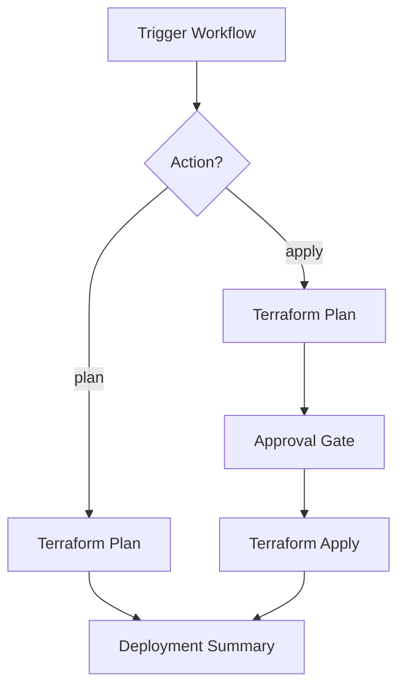

# Azure Landing Zone Terraform Deployment

This repository is part of a dual-repository setup for deploying Azure Landing Zone (ALZ) infrastructure using Terraform and GitHub Actions.

## 📁 Repository Structure

### This Repository: `fst-azcloud-fndtn-ptrn-testing`

Contains environment-specific configuration files (`tfvars`) and GitHub Actions workflows for deployment automation.

```
fst-azcloud-fndtn-ptrn-testing/
├── .github/
│   └── workflows/
│       ├── alz-run-all.yml              # Main workflow (workflow_dispatch + workflow_call)
│       ├── alz-connectivity.yml         # Connectivity subscription deployment
│       ├── alz-identity.yml             # Identity subscription deployment
│       ├── alz-management.yml           # Management subscription deployment
│       ├── alz-security.yml             # Security subscription deployment
│       └── alz-sharedservices.yml       # Shared services subscription deployment
├── alz-platform-vars/
│   └── pattern1/
│       ├── connectivity.tfvars          # Connectivity configuration
│       ├── identity.tfvars              # Identity configuration
│       ├── management.tfvars            # Management configuration
│       ├── security.tfvars              # Security configuration
│       └── sharedservices.tfvars        # Shared services configuration
└── README.md
```

### Gold Repository: `fst-azcloud-goldrepo-testing`

Contains Terraform root modules and reusable Terraform modules.

```
fst-azcloud-goldrepo-testing/
├── alz-platform/
│   ├── pattern1/
│   │   ├── connectivity/                # Connectivity Terraform root module
│   │   │   ├── main.tf
│   │   │   ├── variables.tf
│   │   │   └── backend.tfvars (optional)
│   │   ├── identity_dev/               # Identity Terraform root module
│   │   ├── management/                 # Management Terraform root module
│   │   ├── security/                   # Security Terraform root module
│   │   └── sharedservices/             # Shared services Terraform root module
│   └── pattern2/
│       └── platform-*-alz-deployment/  # Alternative pattern deployments
└── Modules Hub/
    └── terraform-modules/
        ├── module-priority.csv
        ├── AKS/                        # Reusable Terraform modules
        ├── AzureContainerRegistry/
        ├── keyvault/
        ├── storageaccount/
        ├── virtualnetwork/
        ├── ... (70+ reusable modules)
        └── windowswebapp/
```

## 🛠️ GitHub Actions Workflows

### Workflow Architecture

The setup uses a consolidated workflow design:

- **`alz-run-all.yml`**: Main workflow with dual triggers
  - **workflow_dispatch**: Manual UI-based deployment with subscription selector
  - **workflow_call**: Reusable workflow called by individual subscription workflows
  
- **Individual subscription workflows**: Thin wrappers that call `alz-run-all.yml`
  - `alz-connectivity.yml`
  - `alz-identity.yml`
  - `alz-management.yml`
  - `alz-security.yml`
  - `alz-sharedservices.yml`

### Workflow Features

✅ **Cross-repository checkout**: Automatically checks out both repositories  
✅ **Azure OIDC authentication**: Secure, passwordless authentication  
✅ **Environment-based approvals**: Requires approval before apply/destroy  
✅ **Artifact management**: Plan files uploaded/downloaded securely  
✅ **Terraform state management**: Supports backend configuration  
✅ **Deployment summary**: Generates detailed summary after each run

### Workflow Flow



**Jobs Sequence:**
1. **terraform-plan**: Checkout → Setup → Init → Validate → Plan → Upload Artifact
2. **approval-apply**: Environment-based approval checkpoint (only for apply)
3. **terraform-apply**: Download Artifact → Init → Apply (only for apply)
4. **deployment-summary**: Generate GitHub Step Summary

## 🚀 Usage

### Option 1: Deploy Specific Subscription (Individual Workflows)

1. Navigate to **Actions** tab in GitHub
2. Select one of the subscription workflows:
   - `ALZ Connectivity Deployment`
   - `ALZ Identity Deployment`
   - `ALZ Management Deployment`
   - `ALZ Security Deployment`
   - `ALZ Shared Services Deployment`
3. Click **Run workflow**
4. Configure:
   - **Environment**: `NonProduction`
   - **Action**: `plan` or `apply`
5. Click **Run workflow**

### Option 2: Deploy Any Subscription (Main Workflow)

1. Navigate to **Actions** tab in GitHub
2. Select **ALZ Deploy Subscription**
3. Click **Run workflow**
4. Configure:
   - **Subscription**: Select from dropdown (connectivity, identity, management, security, sharedservices)
   - **Environment**: `NonProduction`
   - **Action**: `plan` or `apply`
5. Click **Run workflow**

### Workflow Behavior

| Action | Behavior |
|--------|----------|
| `plan` | Executes Terraform plan and uploads artifact (no approval required) |
| `apply` | Executes plan, waits for approval, then applies changes |

## 🔐 Prerequisites

### Required GitHub Secrets

Configure the following secrets in **Settings → Secrets and variables → Actions**:

| Secret Name | Description | Required |
|-------------|-------------|----------|
| `AZURE_CLIENT_ID` | Azure AD Application (Client) ID for OIDC auth | ✅ Yes |
| `AZURE_TENANT_ID` | Azure AD Tenant ID | ✅ Yes |
| `AZURE_SUBSCRIPTION_ID` | Azure Subscription ID | ✅ Yes |
| `GOLDREPO_PAT` | Personal Access Token for goldrepo (if private) | ⚠️ Conditional |

> **Note**: If `fst-azcloud-goldrepo-testing` is public or in the same organization with proper permissions, `GOLDREPO_PAT` may not be required. The workflow will fall back to `GITHUB_TOKEN`.

### Azure OIDC Setup

1. **Create Azure AD App Registration**
2. **Configure Federated Credentials** for GitHub Actions:
   ```
   Issuer: https://token.actions.githubusercontent.com
   Subject: repo:Gurkirats08/fst-azcloud-fndtn-ptrn-testing:environment:NonProduction
   ```
3. **Assign Azure RBAC permissions** (Contributor or custom role)
4. **Note the Application (client) ID, Tenant ID, and Subscription ID**

### GitHub Environment

Create an environment named `NonProduction`:
1. Go to **Settings → Environments → New environment**
2. Name: `NonProduction`
3. Configure **Required reviewers** (optional but recommended)
4. Save environment

## 📝 Subscription Path Mapping

The workflows automatically map subscription selections to the correct paths:

| Subscription | Terraform Root (goldrepo) | tfvars File (this repo) |
|--------------|---------------------------|-------------------------|
| `connectivity` | `alz-platform/pattern1/connectivity` | `alz-platform-vars/pattern1/connectivity.tfvars` |
| `identity` | `alz-platform/pattern1/identity_dev` | `alz-platform-vars/pattern1/identity.tfvars` |
| `management` | `alz-platform/pattern1/management` | `alz-platform-vars/pattern1/management.tfvars` |
| `security` | `alz-platform/pattern1/security` | `alz-platform-vars/pattern1/security.tfvars` |
| `sharedservices` | `alz-platform/pattern1/sharedservices` | `alz-platform-vars/pattern1/sharedservices.tfvars` |

## 🔧 Terraform Configuration

### Backend Configuration

Each Terraform root module can optionally include a `backend.tfvars` file for remote state configuration:

```hcl
# Example: alz-platform/pattern1/connectivity/backend.tfvars
resource_group_name  = "tfstate-rg"
storage_account_name = "tfstatestorage"
container_name       = "tfstate"
key                  = "connectivity.tfstate"
```

The workflow automatically detects and uses `backend.tfvars` if present.

### Variable Files

Edit the `.tfvars` files in `alz-platform-vars/pattern1/` to configure your environment-specific values:

```hcl
# Example: alz-platform-vars/pattern1/connectivity.tfvars
location            = "eastus"
resource_group_name = "rg-connectivity-prod"
vnet_name          = "vnet-hub-prod"
vnet_address_space = ["10.0.0.0/16"]
# ... additional variables
```

## 📊 Workflow Outputs

After each workflow run, check:

1. **GitHub Actions Summary**: Detailed deployment summary with subscription, action, paths
2. **Terraform Plan Output**: Available in workflow logs
3. **Artifacts**: Plan files retained for 7 days
4. **State Files**: Managed in Azure Storage (if backend configured)

## 🏗️ Repository Design Principles

### Separation of Concerns

| Repository | Purpose | Updates Frequency |
|------------|---------|-------------------|
| `fst-azcloud-goldrepo-testing` | Terraform code, modules, root configurations | Low (standardized infrastructure) |
| `fst-azcloud-fndtn-ptrn-testing` | Environment-specific values, workflows | High (environment changes) |

### Benefits

- 🔒 **Security**: Sensitive values isolated in tfvars, not in code
- ♻️ **Reusability**: Terraform modules shared across subscriptions
- 🎯 **Clarity**: Clear separation between "what to deploy" (code) vs "how to configure" (vars)
- 🔄 **Flexibility**: Update configurations without touching Terraform code
- 🚀 **Automation**: GitOps-style deployment with GitHub Actions

## 🤝 Contributing

### Modifying Terraform Code
1. Make changes in `fst-azcloud-goldrepo-testing`
2. Commit and push to `main` branch
3. Workflows automatically use latest `main` code

### Modifying Configuration
1. Make changes in `alz-platform-vars/` tfvars files
2. Commit and push to `main` branch
3. Run workflow to apply changes

### Modifying Workflows
1. Edit workflows in `.github/workflows/`
2. Test with `plan` action first
3. Get approval for `apply` action

## 📚 Additional Resources

- [Terraform Azure Provider Documentation](https://registry.terraform.io/providers/hashicorp/azurerm/latest/docs)
- [GitHub Actions Documentation](https://docs.github.com/en/actions)
- [Azure Landing Zones](https://learn.microsoft.com/en-us/azure/cloud-adoption-framework/ready/landing-zone/)
- [Azure OIDC with GitHub Actions](https://learn.microsoft.com/en-us/azure/developer/github/connect-from-azure)

## 📋 Version Information

- **Terraform Version**: 1.6.0
- **GitHub Actions**: Reusable Workflows
- **Azure Provider**: Latest (configured in Terraform modules)

## ⚠️ Important Notes

1. **Always test with `plan`** before running `apply`
2. **Review approval gates** are configured for production safety
3. **Terraform state** should be stored in Azure Storage backend
4. **Secrets rotation**: Regularly rotate Azure credentials
5. **Branch protection**: Enable on `main` branch for both repositories

---

**Repository Owner**: Gurkirats08  
**Last Updated**: March 5, 2026  
**Maintained By**: Platform Engineering Team
